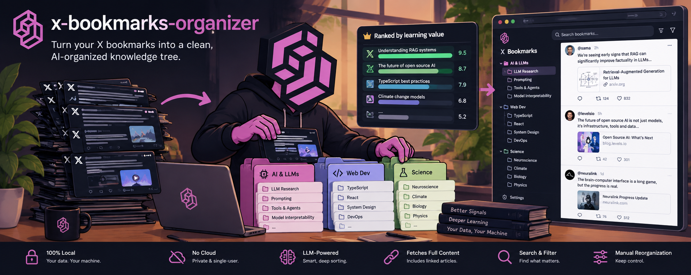

<p align="center">
  
</p>

<p align="center">
  <a href="https://github.com/NachoPal/x-bookmarks-organizer/actions/workflows/ci.yml"></a>
  <a href="LICENSE"></a>
  <a href="CONTRIBUTING.md"></a>
  <a href="https://www.typescriptlang.org/"></a>
  <a href="https://github.com/NachoPal/x-bookmarks-organizer/releases"></a>
  <a href="https://github.com/sponsors/NachoPal"></a>
</p>

# X Bookmarks Organizer

Fetch your X (Twitter) bookmarks, auto-categorize them into a nested topic tree with an LLM,
store them in a local SQLite database you fully own, and browse them through a local web
viewer with read-tracking, favorites and an optional relevance ranking.

- One-time setup (X app, OAuth, credit): [`docs/setup.md`](docs/setup.md)

## Why X Bookmarks Organizer?

X's own bookmark folders are a Premium feature and are flat - one level, no sub-topics - which
falls apart once you have a few hundred saved posts. This is a personal, single-user, local tool
built to fix that for one person's library:

- **Genuinely nested categories**, designed holistically over your whole library rather than
  guessed batch-by-batch, so the tree actually has depth instead of collapsing into a handful of
  broad buckets.
- **You own the data.** Everything lives in one local SQLite file. No account, no hosted service,
  nothing to export.
- **No forced spend.** Categorization runs on your existing Claude subscription by default, not a
  metered API. Every feature that does cost money (an alternative categorizer, ranking, the
  categorizer comparison) is off unless you opt in, needs its own API key, and announces its price
  before every run.
- **Runs occasionally, not continuously.** It's a sync-when-you-feel-like-it tool, not a background
  service - a run only processes bookmarks added since the last one.

It is not a knowledge graph, not multi-user, and not hosted - see the
[PRD](docs/prds/0001-x-bookmarks-organizer.md) for the full scope and non-goals.

## How it works

- **Ingestion** - the official X API v2 bookmarks endpoint (OAuth 2.0 Authorization Code + PKCE,
  user context). Incremental: it pages the bookmark timeline newest-first and stops as soon as it
  reaches a bookmark it has already stored, so previously seen bookmarks are never re-fetched or
  re-categorized.
- **Categorization** - goes through a pluggable **LLM provider** (`src/llm/`), chosen **per pass**.
  The default is `claude-cli`: your **Claude Code subscription**, driven through the local
  `claude` CLI in headless mode - **not** the pay-per-use Anthropic API, so it adds no per-call
  dollar cost. The optional `pi-ai` provider (see
  [Other model providers](#other-model-providers-pi-ai-optional-paid)) runs either pass on a model
  from Anthropic, OpenAI, xAI or OpenRouter **billed per token to your own API key**, or on a local
  OpenAI-compatible server. It works in **two passes**:
  1. **Taxonomy design (holistic).** All bookmarks are shown to the model at once, as a compact
     list, and it designs one coherent, genuinely nested category tree with complete freedom over
     the labels and structure, targeting a minimum nesting depth (`XBOOKMARKS_MIN_DEPTH`, default
     3). This is the hard, large-context step, so it runs on an Opus-class model at high effort
     (`XBOOKMARKS_TAXONOMY_MODEL` / `XBOOKMARKS_TAXONOMY_EFFORT`). It runs **only on the first run**
     (when no tree exists yet) and whenever you run `recategorize`. Incremental runs against an
     existing tree **skip** this pass to conserve quota.
  2. **Assignment.** Each bookmark is filed into the tree - by default a Haiku-class Claude model
     (`XBOOKMARKS_MODEL`) to conserve subscription quota, or optionally a paid alternative (see
     [Choosing the assignment categorizer](#choosing-the-assignment-categorizer-optional-opt-in-paid)
     below). A bookmark may be filed under several branches at once; anything that fits nothing
     lands in `Uncategorized`. On an incremental run, only this cheap pass runs, over the new
     bookmarks: it reuses existing nodes and creates a new one only when a bookmark fits nothing.
     Already-stored bookmarks are never re-touched; use `recategorize` to rebuild the whole tree
     holistically.
- **Storage** - a single local SQLite file (`data/bookmarks.db` by default), fully owned and
  portable. Gitignored.
- **Viewer** - a local web app: the category tree with counts, drill into a node to list its
  bookmarks, each shown as an embedded X post (link fallback where the post is not embeddable).
  Opening a bookmark marks it read; star any post to keep it in Favorites. A tab bar under the top
  bar switches a category's view between Unread / Read / All / Favorites, and a floating sort
  control above the list orders by newest/oldest or - once something has been ranked (see below) -
  highest/lowest score. A category's posts load lazily in batches as you scroll
  (`XBOOKMARKS_PAGE_SIZE`, default 20), so a large category never renders every post at once.
- **Manual re-filing** - any post can be moved by hand if the model guessed wrong: drag the grip
  handle on its action row onto a category in the sidebar, or use the folder icon to pick a
  destination from a searchable, keyboard-operable tree. A move replaces the post's categories
  (files it under exactly the one you picked) and can be undone from the toast that follows.
- **Category editor** - the pencil beside the sidebar's "Categories" heading adds or deletes
  categories by hand. Deleting a category deletes **only** the bookmarks it would orphan: a post
  also filed under a surviving category is kept, just unlinked from the deleted one. The
  confirmation dialog always previews the exact count before you commit.
- **Sync / Reset** - the Sync control in the top bar runs an incremental ingest + categorize from
  the browser, showing the same progress the CLI prints. Reset library (same panel) wipes the
  local library back to never-synced (bookmarks, categories, scores) so the next sync re-pulls
  everything from X - it keeps every piece of your configuration (the X login, the saved
  categorization/ranking choices, authored rubric presets, root category order) and never touches
  anything on X itself. Both require explicit confirmation.
- **Summaries** - click "Summarize" on a bookmark for an on-demand LLM summary of its content (the
  post, plus its extracted article when the reader view can read it) in a large modal. Generated on
  the same LLM provider as categorization, and cached in SQLite so re-opening is instant and free.
  Needs that provider to be available at `serve` time - for `claude-cli`, the `claude` CLI installed
  and logged in. When it is not, the button is disabled with a tooltip explaining exactly what to
  fix; when a call fails, the modal shows the error and you can retry. Everything else in the viewer
  works either way, including already-cached summaries.
- **Ranking** (optional, paid, on by default but key-gated) - scores each bookmark for learning
  value against an editable rubric; see
  [Ranking bookmarks by learning value](#ranking-bookmarks-by-learning-value-optional-opt-in-paid)
  below.

## Prerequisites

- Node.js >= 20
- The `claude` CLI on your `PATH`, logged in (the default `claude-cli` LLM provider)
- A way to provide the two X secrets below - the easiest is a `.env` file (see Secrets); a vault
  such as [Automic Vault](docs/setup.md) (`av`), a shell export, or a systemd unit all work too
- A pay-per-use X API app - see [`docs/setup.md`](docs/setup.md)

## Install & build

```bash
npm install
npm run build
```

## Secrets

Secrets resolve through a **layered credential chain**, first hit wins, so there is no single
required mechanism:

1. **The process environment** - unchanged: a vault such as `av inject`, a shell `export`,
   a Docker `-e` flag, a systemd unit, or CI secrets all keep working exactly as before.
2. **A `.env` file in the project root** - the easy default for running this yourself. Copy
   [`.env.example`](.env.example) to `.env` and fill in what you need; it is gitignored and never
   committed.
3. **Your OS keychain** - macOS Keychain, the Linux Secret Service (`secret-tool`), or Windows
   Credential Manager (`cmdkey`), via the platform CLI.
4. **`~/.config/x-bookmarks-organizer/credentials.json`** - an owner-only (`chmod 600`) file, for
   when none of the above fit.

Nothing is ever read from a *committed* file, and nothing is ever written to disk unless a store
tier is actually used (tiers 3-4).

| Env var                   | What                                             |
| ------------------------- | ------------------------------------------------ |
| `XBOOKMARKS_CLIENT_ID`     | X OAuth 2.0 app Client ID (ingestion only)      |
| `XBOOKMARKS_CLIENT_SECRET` | X OAuth 2.0 app Client Secret (ingestion only)  |
| `CLAUDE_CODE_OAUTH_TOKEN`  | Claude subscription token - **optional**: a `claude` CLI you have logged into interactively needs none. **Required** by the opt-in `pi-claude-subscription` provider ([account risk](#claude-subscription-through-pi-opt-in-account-risk)) |
| `TYPESAFE_API_KEY`         | TypeSafe/Jev API key - **optional**, only for the paid categorizer/ranker/eval features below |

Quickest start - drop a `.env` in the project root:

```bash
cp .env.example .env
# edit .env with your values, then:
node dist/index.js
```

If you already use a vault such as [Automic Vault](docs/setup.md) (`av inject`), it keeps working
unchanged - it is simply one supported provider among several, not the only door:

```bash
av inject +XBOOKMARKS_CLIENT_ID +XBOOKMARKS_CLIENT_SECRET -- node dist/index.js
```

## Usage

You can drive the whole thing from the app, or from the CLI - they share the same code and the
same local database, so either is fine.

### From the app (no terminal after the first start)

```bash
node dist/index.js serve
# then open http://127.0.0.1:5173
```

An empty library opens a three-step setup: authorize X, choose how categorization runs, run the
first sync. After that, the **Sync** button in the top bar fetches new bookmarks and categorizes
them server-side, showing the same progress the CLI prints and refreshing the viewer when it
finishes. The categorization choice - the method (a language model, or Jev), the provider and
model for EACH pass, and the reasoning effort - is saved in the local database and reused by every
later sync; change it any time in the Settings panel (the gear).

The server still needs your X app credentials to sync: it resolves `XBOOKMARKS_CLIENT_ID` and
`XBOOKMARKS_CLIENT_SECRET` through the same layered chain as everything else (environment, `.env`,
OS keychain, `~/.config/x-bookmarks-organizer/credentials.json` - see [Secrets](#secrets)), so
provide them however you prefer *before* starting `serve`. If it cannot reach them, the app says
exactly which one is missing and where it looked, rather than failing mid-sync. Choosing Jev
additionally needs `TYPESAFE_API_KEY` on that same chain, and it is **paid per token** - the app
says so before you pick it, and the sync's progress repeats it on every run.

### From the CLI

**1. One-time login** (opens a browser once; stores a rotating refresh token locally so all later
runs are headless). With a `.env` file in place (see Secrets), just:

```bash
node dist/index.js login
```

Or with a vault such as Automic Vault:

```bash
av inject +XBOOKMARKS_CLIENT_ID +XBOOKMARKS_CLIENT_SECRET -- node dist/index.js login
```

**2. Ingest + categorize** (the default command; run this whenever - roughly weekly):

```bash
node dist/index.js
```

It prints a summary: how many new bookmarks, how many batches, how many new categories.

**Re-categorize** (optional) - rebuild the taxonomy and reassign **all** already-stored bookmarks
from scratch, without re-fetching from X. Use this to redo a shallow earlier run, or after changing
the taxonomy model / depth settings. Read state and read dates are preserved:

```bash
node dist/index.js recategorize
```

(X credentials are not needed for `recategorize` - it only re-reads the local database.)

**Backfill previews** (optional) - a normal `run` already fetches and caches article link metadata
for new bookmarks, but bookmarks synced before that existed have none, so their link contributes
nothing extra to Summarize or categorization. Run this once against an existing library to fetch
and cache metadata for those without touching categories, the taxonomy, or re-fetching from X:

```bash
node dist/index.js backfill-previews
# or: node dist/index.js backfill-previews --retry-failed   (also retries links cached as failed)
```

It is idempotent - safe to re-run; already-cached links (`ok`, and `failed` unless `--retry-failed`
is passed) are skipped. Prints a summary of links found / fetched / cached / failed.

**Backfill X Articles** (optional, one-time, a small PAID X read) - a normal `run` now asks X for
the data of X's native long-form Articles (`x.com/i/article/...`: title, preview, cover, full body),
which the viewer shows as an "X Article" card and feeds to Summarize and categorization. Bookmarks
stored before that have none. Run this once to read it for just those bookmarks - the ones whose
link resolved to an X Article or to another X post they quote (run `backfill-previews` first so
links are resolved):

```bash
node dist/index.js backfill-x-articles --dry-run   # lists what it would read + estimated cost, no X call
node dist/index.js backfill-x-articles
```

Needs your X credentials (it goes through the normal login/refresh-token path). Idempotent - stored
Articles and already-checked quotes are skipped. Afterwards, `recategorize` re-files any of these
bookmarks that were sitting in `Uncategorized`.

**3. Browse** (browsing and cached summaries need no secrets at all):

```bash
node dist/index.js serve
# then open http://127.0.0.1:5173
```

Generating NEW summaries additionally needs the configured LLM provider to be available. With the
default `claude-cli` provider that just means the `claude` CLI is installed and logged in; `serve`
prints which provider and model it resolved, or why summaries are disabled. Syncing from the
viewer needs the X credentials as described above; `serve` also prints how the next sync will be
billed, before you press the button.

**Re-fetch unreadable articles** (optional) - Summarize caches each bookmark's article fetch, and a
link cached as unreadable stays that way even after the fetcher improves. This re-fetches every
article cached without a body and, for each one that now has a body, drops just that bookmark's
cached summary so the next Summarize regenerates it with the article. Every other summary is kept.
No secrets needed; idempotent - re-running only retries what is still unreadable:

```bash
node dist/index.js refetch-articles
```

**Clear cached summaries** (optional) - wipe every saved summary so they regenerate cleanly under
the current logic (e.g. after a bug cached bad/garbage summaries). No secrets, no network - just the
local DB. Idempotent - re-running removes 0:

```bash
node dist/index.js clear-summaries
```

Score stored bookmarks by learning value (**paid**, needs `TYPESAFE_API_KEY` - see "Ranking
bookmarks by learning value" below):

```
node dist/index.js rank --dry-run
```

## Structured bookmark content (for a ranking/scoring tool)

The viewer exposes each bookmark's full content in a structured, labeled shape - meant for a
downstream tool (e.g. a content-scoring/re-ranker) that needs to tell "the bookmarked post's own
text" apart from "the post it quotes", "the external article it links" and "the X-native Article it
hosts or quotes", rather than one flattened blob of text. It is a pure DB read: neither endpoint
makes a network call.

```
GET /api/bookmarks/:id/content        -> { content: BookmarkContent }
GET /api/content?offset=0&limit=20    -> { content: BookmarkContent[], offset, limit, total, hasMore }
```

`BookmarkContent` (`src/content/bookmark-content.ts`):

```ts
interface BookmarkContent {
  bookmarkId: number;
  postId: string;
  post: { kind: 'post'; authorUsername: string; authorName: string; text: string };
  quotedPost: { kind: 'quoted-post'; authorUsername: string; authorName: string; text: string } | null;
  linkedArticle: { kind: 'external-article'; url: string; title: string | null; description: string | null; body: string | null } | null;
  xArticle: { kind: 'x-article'; title: string | null; previewText: string | null; body: string | null; quoted: boolean } | null;
}
```

- `post` is always present - the bookmarked post's own author and text.
- `quotedPost` is the content of an ORDINARY post this bookmark quotes (author + text), captured at
  ingest time from the same X API response that fetches the bookmark itself (no extra request).
  Null when there is no quote, or when the quoted post hosts an X Article instead (see `xArticle`).
- `linkedArticle` is the external article a link in the post's text resolves to. `title`/
  `description` come from the ingest-time link-preview cache whenever it has been fetched; `body`
  is included only when the full reader-view extraction is already cached (it is fetched lazily by
  Summarize/`refetch-articles`, never by this endpoint) - null otherwise. Null when the post has no
  usable link.
- `xArticle` is an X-native long-form Article (`x.com/i/article/<id>`) this bookmark hosts or
  quotes (`quoted` distinguishes which), with its title/preview/full body. Null otherwise.

## Configuration (optional env vars)

The table below covers the ones you're likely to touch; `src/config.ts` is the authoritative,
complete list (it also covers per-role LLM provider overrides and the TypeSafe walk-tuning knobs).

| Env var                 | Default                | Meaning                                  |
| ----------------------- | ----------------------- | ---------------------------------------- |
| `XBOOKMARKS_DB_PATH`     | `data/bookmarks.db`    | SQLite file location                     |
| `XBOOKMARKS_WEB_PORT`    | `5173`                 | Web viewer port                          |
| `XBOOKMARKS_AUTH_PORT`   | `3000`                 | One-time OAuth callback port             |
| `XBOOKMARKS_REDIRECT_URI`| `http://127.0.0.1:3000/callback` | OAuth redirect (must match the X app) |
| `XBOOKMARKS_LLM_PROVIDER`| `claude-cli`           | LLM provider id for every role: `claude-cli`, `pi-ai` (**paid**, see below) or `pi-claude-subscription` (**account risk**, see below) |
| `XBOOKMARKS_TAXONOMY_PROVIDER` / `XBOOKMARKS_ASSIGNMENT_PROVIDER` | - | Provider for just one pass, overriding `XBOOKMARKS_LLM_PROVIDER` |
| `XBOOKMARKS_LLM_MODEL`   | -                      | Model for every role, unless a role overrides it |
| `XBOOKMARKS_MODEL`       | `claude-haiku-4-5`     | Assignment-pass model (Haiku-class); also the summary model if `XBOOKMARKS_SUMMARY_MODEL` is unset AND this is explicitly set |
| `XBOOKMARKS_TAXONOMY_MODEL` | `claude-opus-4-8`   | Taxonomy-design-pass model (Opus-class)  |
| `XBOOKMARKS_TAXONOMY_EFFORT` | `high`             | Taxonomy-pass effort (low/medium/high/xhigh/max) |
| `XBOOKMARKS_BATCH_SIZE`  | `15`                   | Bookmarks per assignment request         |
| `XBOOKMARKS_MIN_DEPTH`   | `3`                    | Target minimum nesting depth (best-effort) |
| `XBOOKMARKS_MAX_DEPTH`   | `4`                    | Maximum category tree depth              |
| `XBOOKMARKS_SUMMARY_MODEL` | `claude-sonnet-5`    | Summary model (Sonnet-class, for quality) |
| `XBOOKMARKS_CLAUDE_BIN`  | `claude`               | Path to the `claude` binary when it is not on `PATH` |
| `XBOOKMARKS_PAGE_SIZE`   | `20`                   | Viewer lazy-load batch size per scroll   |
| `XBOOKMARKS_CATEGORIZER` | `claude-cli`           | Which implementation runs the **assignment** pass: `claude-cli` or `typesafe` (**paid**, see below) |
| `XBOOKMARKS_TYPESAFE_MODEL` | `jev-latest`        | TypeSafe model, when that categorizer is selected |
| `XBOOKMARKS_RANKER`      | `typesafe`             | The **ranking** pass (**paid**, needs `TYPESAFE_API_KEY`; `off` disables it, see below) |
| `XBOOKMARKS_RANKER_MODEL` | `jev-latest`          | TypeSafe model for the ranking pass       |
| `XBOOKMARKS_RANKER_INTERESTS` | -                 | What you care about, in your own words; adds a relevance question to the built-in rubric |
| `XBOOKMARKS_ALLOW_PRIVATE_FETCH` | `false`         | Let article fetches resolve to loopback/private/link-local addresses (off by default; for indexing an intranet) |

Model names and effort levels are interpreted by the selected provider, so a provider that has no
notion of an effort level simply ignores `XBOOKMARKS_TAXONOMY_EFFORT` rather than failing.

The categorizer, per-pass providers and models, and taxonomy effort can also be chosen **in the app**
(Settings → Categorization), which stores them in the local database. Precedence differs by caller,
deliberately: in the viewer the saved choice always wins, so the panel can never read "Claude model"
while a stray variable in the shell that launched `serve` quietly bills per token; on the CLI an
explicitly exported `XBOOKMARKS_*` variable still overrides the saved choice, so a one-off
`XBOOKMARKS_MODEL=... node dist/index.js run` means what it always did.

## Choosing the assignment categorizer (optional, opt-in, **paid**)

The **assignment** pass - filing each bookmark into the existing tree - can run on either of two
implementations. The app's Settings panel is the easiest way to choose (and is what an in-app sync
uses); on the CLI it is `XBOOKMARKS_CATEGORIZER`:

| Value | What runs | Cost |
| --- | --- | --- |
| `claude-cli` (**default**) | The prompt-and-parse categorizer, on the assignment pass's LLM provider (your Claude subscription by default) | **No per-call charge** on `claude-cli`; per token on a `pi-ai` model |
| `typesafe` | A hierarchical beam-search walk on the TypeSafe/Jev API | **Pay per token** (~$0.11 per 1,000 bookmarks) |

**Leave it unset and nothing changes** - categorization stays on the flat-rate subscription and no
code path can spend money. The **taxonomy-design pass always stays on the LLM** either way: Jev is a
classifier and invents no labels.

`typesafe` requires BOTH the explicit opt-in and a `TYPESAFE_API_KEY` resolved through the usual
credential chain; without a key it refuses to run rather than falling back silently (in the app, the
selector says so before you can start a sync). Every run
prints how the pass is billed before making a call. Note that with it enabled your bookmark text is
sent to a third-party hosted API, where today it stays on your machine.

## Other model providers: pi-ai (optional, **paid**)

`pi-ai` drives many model APIs through one SDK ([`@earendil-works/pi-ai`](https://www.npmjs.com/package/@earendil-works/pi-ai),
pinned to an exact version). Either categorization pass can use it, independently: in the app pick
**pi-ai** as that pass's provider in Settings → Categorization; on the CLI set
`XBOOKMARKS_TAXONOMY_PROVIDER=pi-ai` and/or `XBOOKMARKS_ASSIGNMENT_PROVIDER=pi-ai` (or
`XBOOKMARKS_LLM_PROVIDER=pi-ai` for both). A pi-ai model id is `<upstream>/<model>`:

| Upstream | Example id | Needs (credential chain) | Cost |
| --- | --- | --- | --- |
| `anthropic` | `anthropic/claude-haiku-4-5` | `ANTHROPIC_API_KEY` (an `sk-ant-api…` **API** key) | **Pay per token** |
| `openai` | `openai/gpt-5-mini` | `OPENAI_API_KEY` | **Pay per token** |
| `google` | `google/gemini-2.5-flash` | `GEMINI_API_KEY` | **Pay per token** |
| `xai` | `xai/grok-4.6` | `XAI_API_KEY` | **Pay per token** |
| `deepseek`, `mistral`, `moonshotai`, `zai`, `minimax`, `groq`, `cerebras` | `groq/openai/gpt-oss-120b` | `DEEPSEEK_API_KEY`, `MISTRAL_API_KEY`, `MOONSHOT_API_KEY`, `ZAI_API_KEY`, `MINIMAX_API_KEY`, `GROQ_API_KEY`, `CEREBRAS_API_KEY` | **Pay per token** |
| `openrouter` (gateway) | `openrouter/google/gemini-2.5-flash` | `OPENROUTER_API_KEY` | **Pay per token** |
| `opencode` / `opencode-go` (OpenCode Zen / Go gateways) | `opencode/claude-fable-5` | `OPENCODE_API_KEY` (one key for both) | **Pay per token** |
| `vercel-ai-gateway`, `together`, `fireworks`, `huggingface` (gateways) | `together/deepseek-ai/DeepSeek-V4-Flash-0731` | `AI_GATEWAY_API_KEY`, `TOGETHER_API_KEY`, `FIREWORKS_API_KEY`, `HF_TOKEN` | **Pay per token** |
| `local` | `local/llama3.1:8b` | `XBOOKMARKS_PIAI_BASE_URL` (e.g. `http://127.0.0.1:11434/v1`), optional `XBOOKMARKS_PIAI_API_KEY` / `XBOOKMARKS_PIAI_CONTEXT_WINDOW` | Local |

In the app, a pi-ai pass gets an **API provider** dropdown (the upstreams above, gateways grouped
separately) and a **searchable model picker** that loads that upstream's FULL model list from pi's own
catalog - every model with its context window and price - the moment you pick it. Type to filter
(OpenRouter alone lists hundreds), arrow keys and Enter to choose. A few recommended picks lead the
list. Browsing is **free**: the catalog is data bundled in the pi package, read locally - no request,
no key, no spend - so an upstream you have no key for still lists its models, and the dropdown says in
words which key it needs and whether the server found it. On the CLI, any model pi knows works by id
through `XBOOKMARKS_TAXONOMY_MODEL` / `XBOOKMARKS_MODEL`.

It is never a default, a pass without its upstream's key refuses to start (the message names the
key), and every sync prints each pass's billing before it makes a call. Upstreams that need cloud IAM
or an account id (Bedrock, Vertex, Azure, Cloudflare) or a subscription login (Codex, Copilot, Kimi
Coding) are deliberately not wired; `src/llm/providers/pi-upstreams.ts` lists them and why, and adding
a plain-key upstream is one row there.

**`pi-ai` never uses your Claude subscription.** It refuses a subscription token (`sk-ant-oat…`) in
`ANTHROPIC_API_KEY`, pointing you at `claude-cli`, and never reads `CLAUDE_CODE_OAUTH_TOKEN`. The only
way to run the subscription through pi is the separate opt-in provider below.

### Claude subscription through pi (opt-in, **account risk**)

> **Warning.** This route sends your Claude subscription token through pi, which presents itself to
> Anthropic as Claude Code. [Anthropic's Claude Code terms](https://code.claude.com/docs/en/legal-and-compliance)
> reserve subscription OAuth for Claude Code and Anthropic's own apps, prohibit third parties from
> intermediating those credentials, and let Anthropic act against your account without notice.
> `claude-cli` (Anthropic's own binary) is the sanctioned way to use your subscription and stays the
> default. Choose this only if you accept that risk.

Two Claude subscription options exist, and either pass can use either one:

| Provider | How it reaches Claude | Needs |
| --- | --- | --- |
| `claude-cli` (**default**) | The local `claude` binary, hardened (`--safe-mode --tools ""`) | A logged-in `claude` CLI, or `CLAUDE_CODE_OAUTH_TOKEN` |
| `pi-claude-subscription` (opt-in) | pi's Anthropic OAuth (Claude Pro/Max) path, as plain completions | `CLAUDE_CODE_OAUTH_TOKEN` (an `sk-ant-oat…` token from `claude setup-token`) |

Selecting it **is** the opt-in: in the app pick **Claude subscription via pi (against Anthropic's
terms)** as a pass's provider in Settings → Categorization (the selector shows the warning above
under it); on the CLI set `XBOOKMARKS_TAXONOMY_PROVIDER=pi-claude-subscription` and/or
`XBOOKMARKS_ASSIGNMENT_PROVIDER=pi-claude-subscription`. It is never a default. Its models use the
`claude-cli` ids (`claude-opus-4-8`, `claude-haiku-4-5`, `claude-sonnet-5`), with the same Opus-for-pass-1 /
Haiku-for-pass-2 suggestion. The token comes through the usual credential chain and is handed to pi on
every call - pi never looks for a credential itself, and `ANTHROPIC_API_KEY` is never read. A value that
is not a subscription token is refused, because pi would bill an API key per token. Every run prints
the warning beside that pass's billing line.

## Comparing the two categorizers (optional, opt-in, **paid**)

Which of the two above actually files *your* bookmarks better is a question about your library, not
a question with a general answer - so `eval-categorizers` answers it with evidence you can read:

```
node dist/index.js eval-categorizers --dry-run                 # size + rough price; no call of any kind
XBOOKMARKS_EVAL_CATEGORIZERS=typesafe node dist/index.js eval-categorizers
XBOOKMARKS_EVAL_CATEGORIZERS=typesafe node dist/index.js eval-categorizers --limit 50   # a cost ceiling
```

It designs **one** fresh taxonomy (pass 1, Claude), then files every stored bookmark into **that
same tree** with both methods, from the same article/link context, and writes a Markdown report to
`data/eval/` (gitignored). Your library is never written to - the fresh tree lives in a throwaway
database deleted when the run ends. There is deliberately **no in-app trigger** for this, exactly as
with `rank` below - it is CLI-only.

## Ranking bookmarks by learning value (optional, opt-in, **paid**)

You save bookmarks to extract insights from them, so an optional pass scores each one for exactly
that and lets the viewer order by it, using the TypeSafe/Jev API against a rubric you can author
yourself (see [Editing the ranking rubric](#editing-the-ranking-rubric) below).

```bash
node dist/index.js rank --dry-run   # how many would be scored; no API call
node dist/index.js rank             # score them
node dist/index.js rank --limit 50  # a cost ceiling for a first look
node dist/index.js rank --all       # re-score everything, not just what is missing
node dist/index.js clear-scores     # drop every stored score (no key needed)
```

It can also be started from the app: the ranking icon in the top bar opens a panel with a
**Rank now** button, which always opens a confirmation naming the cost before anything runs.

**It never runs on its own.** Ranking is available by default, but the only thing that makes a run
possible is a `TYPESAFE_API_KEY` resolved through the usual credential chain - without one, `rank`
refuses and the in-app button is disabled with "TypeSafe API key missing". Having a key is still
not spending: `rank` only runs when you invoke it, the in-app run additionally requires the explicit
confirmation above, and every run prints how it is billed before making a call (`--dry-run` makes
none at all). Set `XBOOKMARKS_RANKER=off` to remove ranking from the app entirely. Nothing else in
the tool reads any of this: syncing, categorizing, summaries and browsing are untouched either way.
As with the paid categorizer, your bookmark text is sent to a third-party hosted API.

Running it again only scores what is missing, so it is resumable and never pays twice; changing the
rubric changes its version tag, which is what makes those bookmarks stale and re-scored rather than
silently sorted against two different scales.

Once anything is scored:

- the bookmark list exposes it - `score: { value, confidence, dimensions } | null`, null for a
  bookmark that was never ranked, which is not the same as a score of zero;
- `GET /api/categories/:id/bookmarks?sort=score` pages the category by it, highest first, with
  unranked bookmarks last;
- the viewer's floating sort control gains a "Top score" option (disabled until something is
  ranked), and each ranked card shows its rating as a chip, with the per-question breakdown behind
  it.

### Editing the ranking rubric

The rubric is not fixed - "Edit ranking rules" in the ranking panel opens an editor for **named
presets** you author yourself: the question, levels and weight for each dimension, with add /
remove / reorder. The built-in preset (four questions - learning value, insight density,
durability, actionability - plus a relevance question when `XBOOKMARKS_RANKER_INTERESTS` is set) is
always available and can be cloned to start from, but not edited or deleted directly. Scores are
kept **per preset**: switching which one is active never deletes anything, it just means bookmarks
scored under a different rubric show as unranked until you re-rank them under the new one.

## Development

```bash
npm test          # unit tests (no network, no credentials)
npm run typecheck # tsc --noEmit
npm run lint      # eslint (TypeScript + src/web/public/**/*.js)
npm run build     # compile to dist/ and copy the web assets
```

Tests use fixtures/mocks for both the X API and the LLM, so they run offline with no credentials.

To iterate on the viewer without touching your real library, seed a throwaway database and serve
it instead:

```bash
npm run build && npm run seed:dev
XBOOKMARKS_DB_PATH=data/dev-seed.db node dist/index.js serve
```

See [`AGENTS.md`](AGENTS.md) for the project's architecture, conventions and the sharp-edge notes
behind each feature.

## Contributing

Contributions are welcome. [CONTRIBUTING.md](CONTRIBUTING.md) has local setup, the CI gates a
change must pass, branch/PR conventions and the project's hard invariants; all participation is
under the [Code of Conduct](CODE_OF_CONDUCT.md).

## License

[Apache-2.0](LICENSE)
